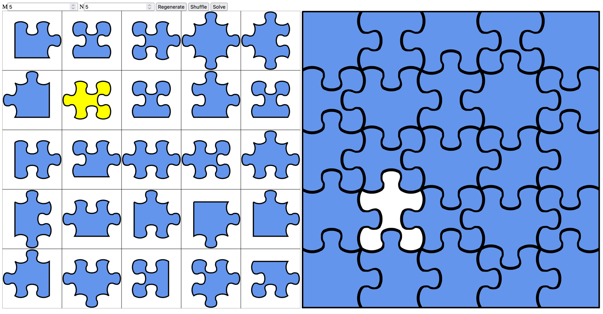

## Introduction

Solves White jigsaw puzzles, which means there is no picture or anything on each piece.
Also assuming all tabs and pockets fit each other. 

Due to [Damien and Damien](https://erikdemaine.org/papers/Jigsaw_GC/paper.pdf) we know these are NP complete.
This project tries to formulate a SAT / SMT problem which can be solved 


| Formulation                 | Number of Variables | Number of Clauses |
|-----------------------------|---------------------|-------------------|
| [1](https://mathb.in/77183) | n^2 + 4n            | 48n^4 + n^2 + n   |
| [2](https://mathb.in/77190) | n^2 + 6n            | 16n^2 + 4n        |
| [3](https://mathb.in/77209) | 26n                 | O(n log(n))       |

Long story short. In Formulation 1, 10x10 was fast enough to run in a few minutes, 
13x13 took hours and 100s of GB of memory. Formulation 2, 13x13 takes around 30 seconds,
largest I can run is about 18x18. Formulation 3, I can run 32x32 in just 2-3 seconds. I
think we have finally reached the limit of this. 64x64 runs in 237 seconds. 70x72 (5040 piece)
puzzle took about 24 minutes.

There are two supported solvers, one is [Google OR Tools](https://developers.google.com/optimization), 
and other is [MiniSAT](http://minisat.se/). In fact I support any tool like MiniSAT that takes 
input as a [DIMACS](https://www.cs.utexas.edu/users/moore/acl2/manuals/current/manual/index-seo.php/SATLINK____DIMACS)
cnf file as first argument and second argument as output file. There is one part missing
implementation in the `MiniSAT` solver that is needed for `formulation 3`. 

You can compile code using maven. 
```shell
brew install maven # If on OSX of course. 
mvn package
```

To invoke the OR Tools solver which is supported for all formulations, use: 
```shell 
java -jar target/jigsaw-1.0-SNAPSHOT.jar --random --M=32 --N=32 
```

To use `MiniSAT` you can pass the argument `--sat_solver_path=` to the path where you
have installed it locally. Since only two formulations are supported here, you need
to specify that as well. Example:
```shell
java -jar target/jigsaw-1.0-SNAPSHOT.jar --random --M=5 --N=5 \
  --sat_solver_path=/Users/anita/bin/bin/minisat \
  --formulation=2
```

## Benchmarks
All benchmarks using OR Tools with 15G heap space, in 8 core M2 macbook Air. It
is a multithreaded solver, so more cores will make it run faster. 

| Problem  | Pieces(n) | Formulation 1 | Formulation 2 | Formulation 3 |
|----------|-----------|---------------|---------------|---------------|
| 5x5      | 25        | 2.78 s        | 0.59 s        | 0.42 s        |
| 10x10    | 100       | 214 s         | 2.88 s        | 0.58 s        |
| 15x15    | 225       | O.O.M.        | 16.98 s       | 1.04 s        |
| 20x20    | 400       |               | 1257 s        | 1.83 s        |
| 32x32    | 1024      |               | O.O.M.        | 10.86 s       |
| 64x64    | 4096      |               |               | 237 s         |
| 70x72    | 5040      |               |               | 1435 s        |

## TODO

* TODO: Take custom user pieces instead of random.
* TODO: Use better SAT solvers like Glucose.
* TODO: Submit the problems to SAT competition 2023.
